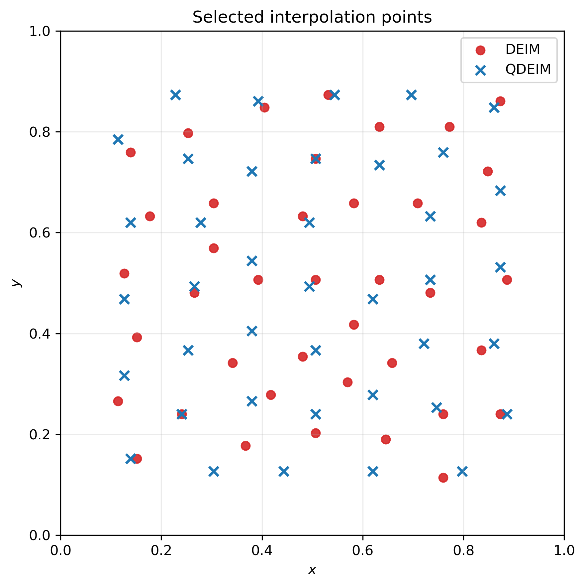
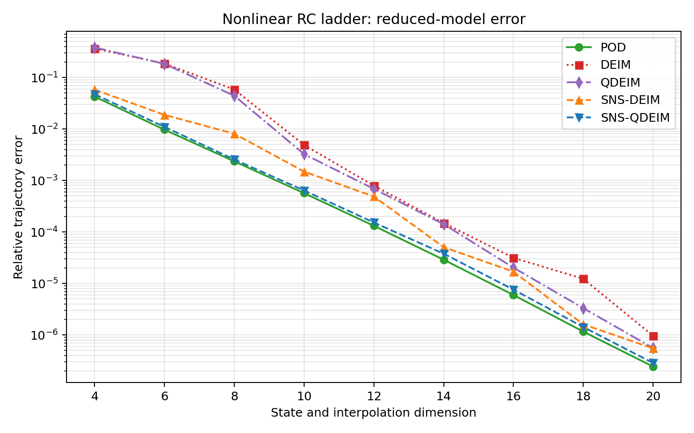
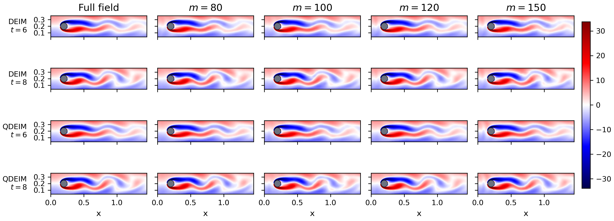

# Discrete Empirical Interpolation Method

This repository accompanies the master's thesis **Discrete Empirical Interpolation
Method** by Matko Petričić, completed at the Department of Mathematics, Faculty of
Science, University of Zagreb in 2026 under the supervision of Prof. Zlatko Drmač.

- [Read the thesis](thesis/Matko-Petricic-Masters-Thesis.pdf)
- [University repository record](https://repozitorij.pmf.unizg.hr/object/pmf:15584)
- [Open the interactive presentation](https://m8tko.github.io/Masters-Thesis-DEIM/)
- [Download the presentation PDF](presentation/DEIM-presentation.pdf)

## About the project

The thesis studies the discrete empirical interpolation method (DEIM) and related
index-selection strategies for approximating high-dimensional nonlinear functions
from a small number of sampled components. It covers:

- proper orthogonal decomposition (POD) and low-rank approximation;
- the classical greedy DEIM algorithm;
- QDEIM based on column-pivoted QR factorization;
- restricted sensor selection;
- POD--DEIM and SNS hyper-reduction for nonlinear dynamical systems;
- sparse vorticity-field reconstruction for a two-dimensional cylinder wake.

The Navier--Stokes example is a **sparse state-reconstruction experiment**. It
reconstructs already available vorticity fields from selected spatial samples; it
is not a reduced Navier--Stokes time integrator.

## Repository contents

```text
thesis/        Final thesis PDF
presentation/  Final presentation PDF
docs/          Interactive HTML presentation served by GitHub Pages
experiments/   Curated scripts for the numerical experiments
results/       A small selection of thesis figures
```

The LaTeX and Beamer working trees, intermediate build files, downloaded papers,
and multi-gigabyte simulation datasets are intentionally not part of the public
repository.

## Reproducing the experiments

Most examples use NumPy, SciPy and Matplotlib:

```bash
python -m venv .venv
source .venv/bin/activate
python -m pip install -r requirements.txt
```

Individual commands are listed in [experiments/README.md](experiments/README.md).
The Navier--Stokes solver additionally requires FEniCSx/DOLFINx and MPI; see
[its dedicated README](experiments/navier-stokes/README.md).

The large cylinder-wake snapshot matrices are not stored in Git. Their expected
layout, dimensions and regeneration commands are documented in
[DATA.md](DATA.md).

## Selected results

### DEIM and QDEIM sensor locations



### Nonlinear RC-ladder comparison



### Sparse vorticity reconstruction



## Citation

Please cite the thesis using the metadata in [CITATION.cff](CITATION.cff) or the
record in the [University of Zagreb Faculty of Science Repository](https://repozitorij.pmf.unizg.hr/object/pmf:15584).

## Licenses

This is a mixed-license repository:

- the thesis PDF is available under **CC BY 4.0**;
- original source code is available under the **MIT License**;
- no separate reuse license is granted for the presentation as a compilation;
- third-party components and adapted material retain their respective licenses.

See [LICENSE.md](LICENSE.md) and [THIRD_PARTY_NOTICES.md](THIRD_PARTY_NOTICES.md)
for the exact scope and attribution notices.
